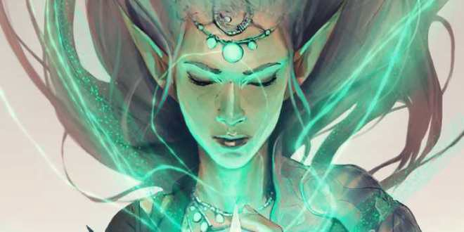
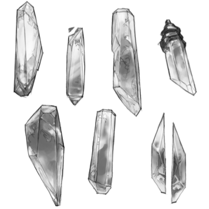

# Cineris campaign README

Game master: [Chad Sansing](mailto:csansing@gmail.com), [@chadsansing](https://twitter.com/chadsansing)

[Roll20](https://app.roll20.net/join/3196521/G7lx7Q)

## Welcome to Cineris!

Cineris is a homebrew campaign setting for [Cryptomancer](http://cryptorpg.com), a fantasty role-playing game about information security.

Cineris is a continent on Sphere, Cryptomancer's game world.

On Cineris, dwarves, elves, and humans are interconnected in a complicated economy of scarcity.

- Through superior numbers and a costly military campaign, humans colonized the dwarven homelands and now control crystal mining below ground and food production above ground.
- Dwarves have split into two factions after retreating from their homelands. One faction mines an arid wasteland for precious minerals and gems; the other has assimilated into elven society. 
- Elves have retreated with their dwarven allies into a deep forest to farm Soma and range for substinance.

Although the wasteland dwarves hate their woodland cousins, both factions dream of retaking their homelands from the humans through temporary alliances, economics, intrigue, politics, and eventual violence. The Risk Eaters, Cryptomancer's actuarial-illimunati of the future, periodically nurture strife and chaos across Cineris to keep all of its inhabitants' ambitions in check.

Because of this web of interests and trade, agents from every race move relatively freely in one another's society, advancing obvious and hidden agendas alike.

In the midst of this uneasy era, your characters have all been drawn together by fate, happenstance, or something else, to witness and flee from an especially brazen and viscious Risk Eater attack in the wasteland's capital city of Portia.

Learn more about the world from [world-building.md](world-building.md).

You can find other resources for this campaign in the [player-resources](player-resources/) folder, as well.

## Getting started with RPGs

***What’s a role playing game?*** A role-playing game, or RPG, is a collaborative, social, table-top storytelling game. A game-master runs the game while players improvise and act out their characters’ in-game actions and responses to the story.

In a role-playing game, players’ successes and failures are determined by how well they play their parts and the rules that go along with the game they’re playing. Player characters (PCs) have detailed character sheets that list their attributes, powers, and belongings. Typically, RPGs use a combination of’ statistics (stats) like strength (STR) or intelligence (INT) found on a character sheet and die rolls to determine the results of players’ decisions and their characters’ actions.

*Some dice you might use in a role-playing game, [CC0 OpenClipart-Vectors](https://pixabay.com/en/dice-cube-gaming-platonic-solids-160388/)*

RPGs often have some funky dice, as well. A normal 6-sided die — like the kind that comes with most board games, is called a d6. Many games use 4, 8, 10, 12, and 20-sided die, as well, abbreviated as d4, d8, d10, d12, and d20, respectively. Specialty dice like d2, d30, and even d100 also exist.

Before playing, the game master writes an adventure for their players and creates all the non-player characters (NPCs), enemies, obstacles, and puzzles they’ll encounter. Several adventures played over a series of sessions make up a campaign. Over the course of the campaign, the game master awards players experience points they can use to strengthen their characters’ abilities, inventories, and skills.

If you are new to role playing games (RPGs), check out resources like these to see what they're all about:

- [5 Tips for Better Inclusion in Tabletop Games](http://geekandsundry.com/5-tips-for-better-inclusion-in-tabletop-games/)
- ["Role Playing Games" on the Geek Feminism Wiki](http://geekfeminism.wikia.com/wiki/Roleplaying_games)
- [How to Make Your Role Playing Game Enjoyable](http://www.wikihow.com/Make-Your-Role-Playing-Game-Enjoyable) *Written for video games, but with a lot of good tips for tabletop RPGs, as well.*
- [Ki Khanga: The Sword and Soul Role Playing Game](https://www.kickstarter.com/projects/mvmedia/ki-khanga-a-sword-and-soul-role-playing-game/description)
- [Ehdrigohr](https://www.kickstarter.com/projects/601893462/ehdrigohr-the-roleplaying-game)
- [Sigmata](https://www.kickstarter.com/projects/2089483951/sigmata-this-signal-kills-fascists)

In this repo, we'll talk about

- **Players:** the people who control characters in the game.
- **Characters:** the identities that players control and perform in the game.
- **Game Master:** the story teller and rules judge for the game who keeps it moving and play all the non-player characters (NPCs) who show up.
- **Observers:** the people who stop to watch and listen to the game.
- **Local game store:** where we play a game face-to-face, also called an LGS or FLGS for "friendly local game store."
- **Rolld20.com:** where we play a game online along with some kind of conferencing software.
- **Session:** a real-world time when we play tha game, like from 2 PM to 6 PM on a Saturday afternoon.
- **Adventure:** an episode in the game that we play through together; an adventure may last for a single session or run across many of them.
- **Campaign:** a series of interconnected adventures that build toward climax and resolution, like a novel (campaign) made of chapters (adventure) or a movie (campaign) made of scenes (adventures).

## Getting started with Cryptomancer

Cryptomancer is a unique RPG that teaches online safety in a fantasy world that has its own Internet called the “Shardnet.”

*An elf character from Cryptomancer, ©Chad Walker, used with permission*

***What’s a Cryptomancer?*** Cryptomancer is an RPG in which players act as secret agents trying to prevent a shadowy organization from controlling the world through surveillance. In this world, traditional Western fantasy races and tropes all get shifted to account for the presence of the Shardnet, an Internet made of crystals. A “Cryptomancer” is someone who uses the powers of information security — like encryption — the same way a wizard might use magic in a different game.

Here's a [45-minute crash course on Cryptomancer](https://www.youtube.com/watch?v=T_2hvrGdBO4&t=6s) from the game's author.

To prevent your group of secret agents from being discovered in Cryptomancer, you have to role-play strong information security habits and keep your crystals, messages, and group safe. The game uses simple illustrations and an approachable rules set to help you act out things like basic encryption and trust-building across your in-game networks and adventures. These opportunities to role-play successful online safety habits can help players strengthen their privacy and security habits in life outside the game.

*Crystals from the Shardnet, ©Chad Walker, used with permission*

***What’s a Shardnet?*** In Cryptomancer, the Shardnet is made up of two complementary systems. The Shardnet itself is a massive network that anyone can join by holding a piece, or shard, of a massive crystal that connects everyone who has a piece of it. Smaller, private networks are made up of a limited numbers of shards cut from smaller crystals found elsewhere in the world. Each crystal is like a smartphone on a different network. You can also bridge from network to network or from network to Shardnet by holding crystals from different networks in different hands.

## Player resource credits

- The [fillable character sheet](player-resources/fillable-character-sheet.pdf) in this repo was made by [@Masterwolf2050](https://github.com/Masterwolf2050/cryptomancer-challenge-Characters/blob/master/character_sheet-Fillable.pdf) as part of the 2017 Global Sprint's [Cryptomancer Chalenge](https://github.com/MozillaFoundation/mpa-cryptomancer-challenge/).
- The [cryptomancer-quick-reference.pdf](/player-resources/cyptomancer-quick-reference.pdf) was shared by [Ozasuke](https://www.reddit.com/r/Cryptomancer/comments/5trx4g/pdf_gm_reference_sheet/).
- Other [game resources](http://cryptorpg.com/downloads/) made and shared by @cryptomancer-actual.
- PC models in the images folder were made with [Hero Forge's](https://www.heroforge.com/) online editor.
- Other campaign resources by @chadsansing.

## Contribute to this campaign

Check out [CONTRIBUTING.md](CONTRIBUTING.md) to share ideas and suggestions for improvement with game master [Chad Sansing](mailto:csansing@gmail.com) ([@chadsansing](https://twitter.com/chadsansing)).
